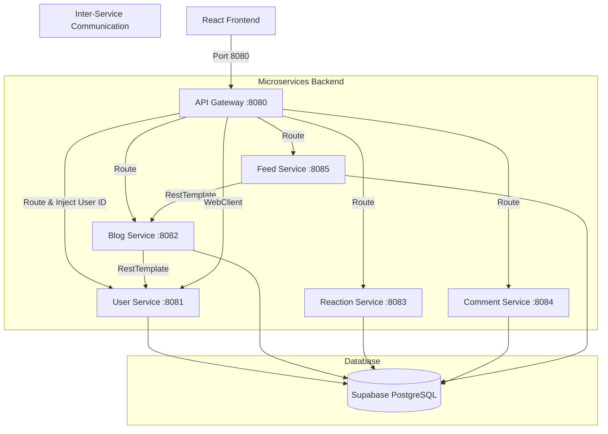

# Daily Diaries - Microservices Social Blogging Platform

Daily Diaries is a social blogging platform built with a modern microservices architecture using **Spring Boot**, **Spring Cloud Gateway**, and **React**. The application connects to a serverless **Supabase PostgreSQL** database, utilizes **JWT-based stateless authentication**, and supports rich blog creation with image uploads.

---

## 1. High-Level Architecture

The project is split into a React frontend client, a centralized API Gateway, and 5 independent microservices communicating via HTTP REST APIs.



### Microservice Directory:
* **[API Gateway](file:///f:/projects/blog/backend/api-gateway)** (Port 8080): Directs request traffic and runs a global filter to validate incoming JWTs and inject the authenticated user's ID (`X-Auth-User-Id` header).
* **[User Service](file:///f:/projects/blog/backend/user-service)** (Port 8081): Manages registration, logins, token generation, user profiles, and saved/bookmarked blogs.
* **[Blog Service](file:///f:/projects/blog/backend/blog-service)** (Port 8082): Manages blog creation, retrieval, deletion, and content formatting.
* **[Reaction Service](file:///f:/projects/blog/backend/reaction-service)** (Port 8083): Tracks blog likes/unlikes.
* **[Comment Service](file:///f:/projects/blog/backend/comment-service)** (Port 8084): Tracks and displays comments.
* **[Feed Service](file:///f:/projects/blog/backend/feed-service)** (Port 8085): Manages user follows and constructs a personalized homepage feed.

---

## 2. Prerequisites

* **Java 17 or higher** (JDK)
* **Maven 3.8+**
* **Node.js** (v16+ and npm)
* A **PostgreSQL** database (Supabase free cloud tier recommended)

---

## 3. Database Setup (Supabase)

The backend uses **Spring Data JPA & Hibernate** to automatically compile entity classes into database tables. However, a few manual settings are required:

1. **Auto-Generate Tables**: Run all backend services once. Hibernate will automatically connect to your database and generate `users`, `blogs`, `comments`, `reactions`, and `followers` tables.
2. **Create the `saved_blogs` Table**: The saved/bookmarked blogs list is queried with raw JDBC and has no Java Entity file. Create it manually in your **Supabase SQL Editor**:
   ```sql
   CREATE TABLE IF NOT EXISTS saved_blogs (
       user_id BIGINT NOT NULL,
       blog_id BIGINT NOT NULL,
       PRIMARY KEY (user_id, blog_id)
   );
   ```
3. **Configure Columns for Base64 Images**: Since blog cover images and text content are sent as large base64 strings, we must expand the column constraints from `VARCHAR(255)` to `TEXT`. Run this in the **SQL Editor**:
   ```sql
   ALTER TABLE blogs ALTER COLUMN title_image TYPE TEXT;
   ALTER TABLE blogs ALTER COLUMN content TYPE TEXT;
   ```

---

## 4. Backend Setup & Run

### Step 1: Configure Connection Settings
In all 5 microservices, locate the `application.properties` (or `application.yml` for API Gateway) under `src/main/resources/` and update your database credentials:
```properties
spring.datasource.url=jdbc:postgresql://<SUPABASE_HOST>:5432/postgres
spring.datasource.username=postgres
spring.datasource.password=<YOUR_SUPABASE_PASSWORD>

# Crucial for Free DB tiers: limits connections to avoid exceeding database slot limits
spring.datasource.hikari.maximum-pool-size=2
```

### Step 2: Build the Backend
From the root of the `backend` directory, run:
```bash
mvn clean install -DskipTests
```

### Step 3: Run the Services (In Order)
Import the project into **IntelliJ IDEA** (Recommended) or run each main application class using Maven inside separate terminal windows in the following order:

1. **User Application**: `UserServiceApplication.java` (:8081)
2. **Blog Application**: `BlogServiceApplication.java` (:8082)
3. **Reaction Application**: `ReactionServiceApplication.java` (:8083)
4. **Comment Application**: `CommentServiceApplication.java` (:8084)
5. **Feed Application**: `FeedServiceApplication.java` (:8085)
6. **API Gateway**: `ApiGatewayApplication.java` (:8080)

---

## 5. Frontend Setup & Run

The frontend is built with React.

### Step 1: Exclude Legacy Peer Dependencies
Since the project uses React 19 alongside older styling libraries, you must override peer dependency checks during install:
```bash
cd frontend
npm install --legacy-peer-deps
```

### Step 2: Check API Constant URL
Verify that the server connection URL in `frontend/src/constants.js` points to the API Gateway:
```javascript
export const BASEURL = "http://localhost:8080/api/v2";
```

### Step 3: Start the App
```bash
npm start
```
The client will start running at **http://localhost:3000**.

---

## 6. Key Features & Design Choices

* **Stateless Gateway Security**: The API Gateway intercepts requests, validates the JWT token, extracts the email, and queries the User Service to attach `X-Auth-User-Id` downstream. Other services don't need authentication logic.
* **HikariCP Pool Sizing**: Set `maximum-pool-size=2` across all microservices to optimize connection slots, allowing 5 parallel microservices to connect successfully within Supabase's free tier connection limits.
* **Optimistic UI Rendering**: The frontend updates follower buttons and bookmark states instantly, reverting changes seamlessly if the backend API returns an error.
